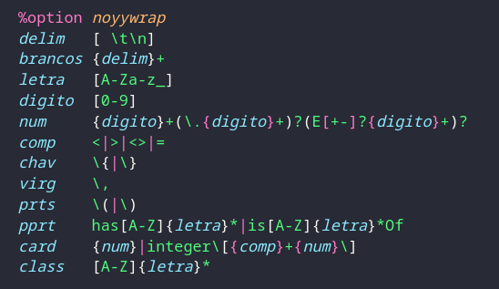
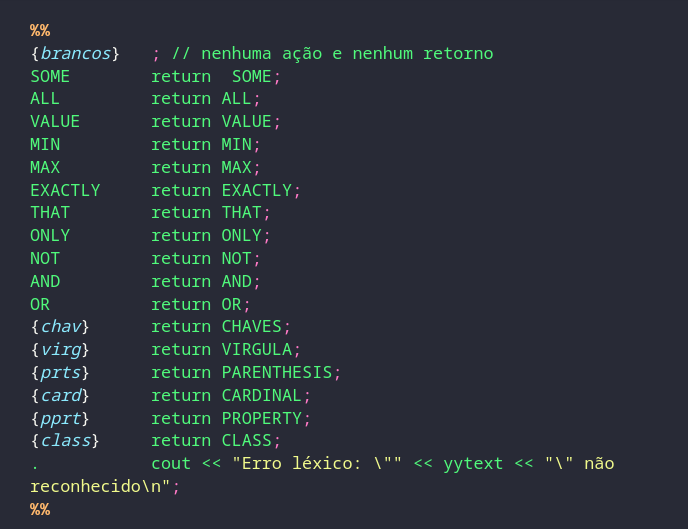
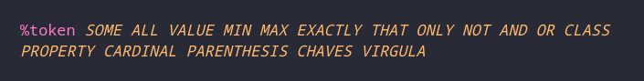
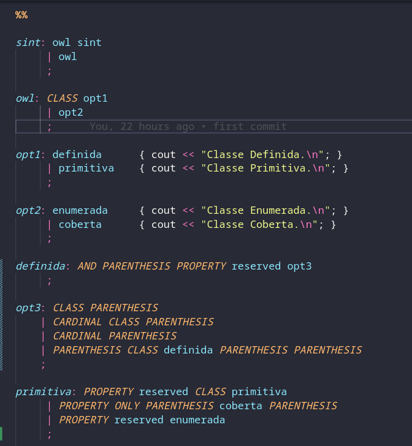
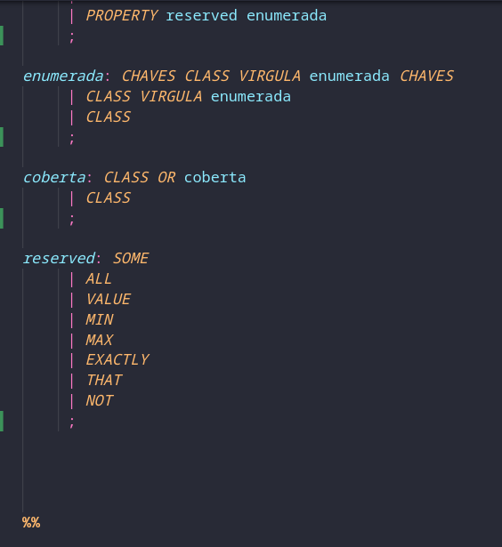

# analisador-sintatico

Analisador Sintático para análise de classes da linguagem OWL2 (Formato Manchester Syntax).

Caso esteja utilizando o Windows, considere usar o WSL para executar o código.

Se necessário, siga este tutorial: <https://learn.microsoft.com/pt-br/windows/wsl/install>

Instale a distribuição Ubuntu.

Agora siga os passos a seguir para poder executar o código.

- sudo hwclock --hctosys
- sudo apt update -y
- sudo apt install -y g++
- sudo apt install -y make
- sudo apt install -y cmake
- sudo apt install -y flex
- sudo apt install -y bison

Agora, precisamos clonar o repositório do código usando o seguinte comando.

- git clone https://github.com/abralima/analisador-sintatico.git

Após isso, execute os seguinte comandos.

- ./frases < input

Caso queira testar com algumas classes diferentes, basta alterar o conteúdo do arquivo input.

## Analisador Lexico

Está dentro do arquivo frases.l, e nele contém toda a lógica para reconhecimento de tokens e palavras reservadas, utilizando-se de expressões regulares.

Expressões Regulares

Geração e Reconhecimento de Tokens

## Analisador Sintatico

Está dentro do arquivo frases.y, e nele contém toda a lógica para reconhecimento de padrões de classes, dado uma consistência de sequência de tokens recebidos do analisador léxico.

Declaração dos Tokens

Gramática

